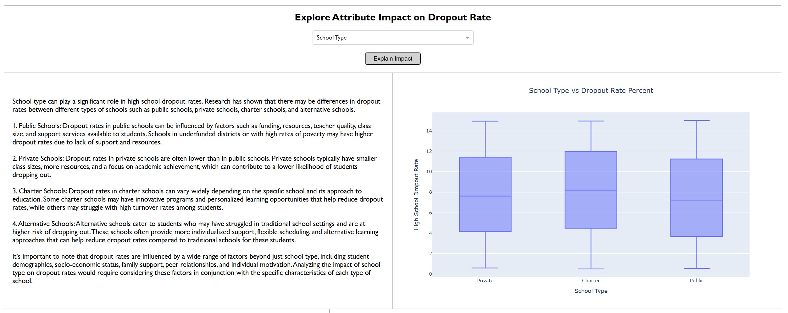

# 📚 Education Inequality: Exploring School Dropout Rates

## 📝 Description

This project explores factors contributing to school dropout rates across the United States using a dataset containing school-level indicators such as funding, test scores, student-teacher ratios, and more. This interactive dashboard built with Plotly Dash enables users to visualize, filter, and interpret patterns related to education inequality and student retention.

## 📂 Table of Contents

- [Installation](#installation)
- [Usage](#usage)
- [Methodology](#methodology)
- [Results](#results)
- [Conclusion](#conclusion)
- [License](#license)

## 📦 Installation

To run this project locally, follow these steps:

1. Clone the repository:
    ```bash
    git clone https://github.com/CxLos/Education_Inequality
    ```
2. Navigate to the project directory:
    ```bash
    cd Education_Inequality
    ```
3. Install the required dependencies:
    ```bash
    pip install -r requirements.txt
    ```

## ▶️ Usage

- This is an interactive Plotly/Dash dashboard. You can explore different aspects of the data, including class distribution, prediction outcomes, and feature importance. Hover over charts for tooltips and use zoom to inspect data more closely.

- To launch the dashboard locally:
    ```bash
    python edu_inequality.py
    ```

- Or access the live version here:  
  🌐 [Education Inequality Dashboard]()



## 🧪 Methodology

- Dataset: The dataset was sourced from Kaggle. It contains over 1,000 schools with the following features:

    - Funding Per Student (USD)

    - Average Test Score (%)

    - Student-Teacher Ratio

    - Percent Low-Income Students

    - Percent Minority Students

    - Internet Access (%)

    - Dropout Rate (%), among others

- **Preprocessing**:

    - Cleaned missing or inconsistent data

    - Standardized numerical features

    - Encoded categorical variables like school type and grade level

- **Modeling**:

    - Exploratory Data Analysis (EDA) with visualizations

    - Correlation heatmaps and regression modeling to identify key drivers of dropout rates

## Results


### 🔍 Insights

    - Schools with higher funding per student often report lower dropout rates.

    - Dropout rates are significantly higher in schools with a greater percentage of low-income or minority students.

    - Better internet access is associated with improved academic performance and retention.

### 🌟 Feature Importance

1. Percent Low-Income

2. Funding Per Student

3. Student-Teacher Ratio

4. Internet Access Percent

## ✅ Conclusion

This dashboard provides a comprehensive overview of educational disparities and their impact on student retention. The findings support the importance of equitable resource allocation to improve student outcomes and reduce dropout rates across U.S. schools.

## 📄 License

MIT License

© 2025 CxLos

Permission is hereby granted, free of charge, to any person obtaining a copy
of this software and associated documentation files (the "Software"), to deal
in the Software without restriction, including without limitation the rights
to use, copy, modify, merge, publish, distribute, sublicense, and/or sell
copies of the Software, and to permit persons to whom the Software is
furnished to do so, subject to the following conditions:

The above copyright notice and this permission notice shall be included in all
copies or substantial portions of the Software.

THE SOFTWARE IS PROVIDED "AS IS", WITHOUT WARRANTY OF ANY KIND, EXPRESS OR
IMPLIED, INCLUDING BUT NOT LIMITED TO THE WARRANTIES OF MERCHANTABILITY,
FITNESS FOR A PARTICULAR PURPOSE AND NONINFRINGEMENT. IN NO EVENT SHALL THE
AUTHORS OR COPYRIGHT HOLDERS BE LIABLE FOR ANY CLAIM, DAMAGES OR OTHER
LIABILITY, WHETHER IN AN ACTION OF CONTRACT, TORT OR OTHERWISE, ARISING FROM,
OUT OF OR IN CONNECTION WITH THE SOFTWARE OR THE USE OR OTHER DEALINGS IN THE
SOFTWARE.